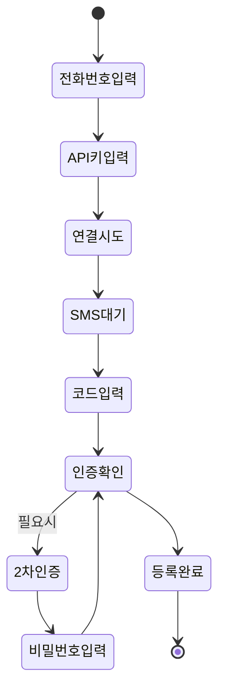
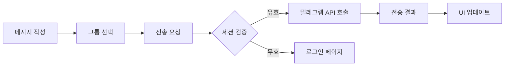

# 텔레그램 멀티 챗 매니저 - 시스템 아키텍처

## 🏗️ 전체 시스템 구조

```
┌─────────────────────────────────────────────────────────────────┐
│                        웹 브라우저 (클라이언트)                     │
│  ┌─────────────┐  ┌──────────────┐  ┌────────────────────┐     │
│  │ login.html  │  │ index.html   │  │ api_register.html  │     │
│  └──────┬──────┘  └──────┬───────┘  └────────┬───────────┘     │
│         │                 │                    │                  │
│         └─────────────────┴────────────────────┘                 │
│                           │                                       │
│                      app.js + config_client.js                   │
└───────────────────────────┬─────────────────────────────────────┘
                            │ HTTP/HTTPS
                            │ (Credentials: include)
┌───────────────────────────┴─────────────────────────────────────┐
│                        백엔드 서버 레이어                          │
│                                                                  │
│  ┌────────────────────┐  ┌─────────────────┐  ┌──────────────┐ │
│  │ telegram_server.py │  │ proxy_server.py │  │license_server│ │
│  │    (포트 5000)     │  │   (포트 5002)   │  │  (포트 5001) │ │
│  │                    │  │                 │  │              │ │
│  │ - API 등록         │  │ - 메시지 전송   │  │ - 라이센스   │ │
│  │ - 세션 관리        │  │ - 그룹 관리     │  │ - 인증 검증  │ │
│  │ - 계정 관리        │  │ - 프록시 설정   │  │ - 사용 로그  │ │
│  └────────┬───────────┘  └────────┬────────┘  └──────┬───────┘ │
│           │                        │                   │         │
│           └────────────────────────┴───────────────────┘         │
│                                    │                             │
└────────────────────────────────────┴─────────────────────────────┘
                                     │
                                     │ Telethon API
                                     │
┌────────────────────────────────────┴─────────────────────────────┐
│                         텔레그램 서버                              │
│                                                                  │
│  - SMS 인증                                                      │
│  - 2차 비밀번호 인증                                              │
│  - 메시지 전송                                                    │
│  - 그룹 관리                                                      │
└──────────────────────────────────────────────────────────────────┘
```

## 🔧 핵심 컴포넌트

### 1. 프론트엔드 (Web Client)

#### 구성 요소
- **HTML 페이지**: 사용자 인터페이스
- **app.js**: 메인 애플리케이션 로직
- **config_client.js**: 클라이언트 설정 관리

#### 주요 기능
```javascript
// API 요청 통합 관리
async function apiRequest(url, options = {}) {
    // 인증 헤더 자동 추가
    // 에러 처리 및 리다이렉트
    // 세션 관리
}

// 상태 관리
const appState = {
    apis: [],           // 등록된 API 목록
    rooms: {},          // 그룹/채널 정보
    currentPhone: null  // 현재 활성 계정
}
```

### 2. 백엔드 서버

#### telegram_server.py (메인 서버)
```python
# Flask 앱 구조
app = create_app()
app.register_blueprint(api_register_bp)  # API 등록
app.register_blueprint(auth_bp)         # 인증

# 핵심 데코레이터
@login_required  # 로그인 필수
@error_handler   # 에러 처리
@validate_phone_required  # 전화번호 검증
```

#### proxy_server.py (보조 서버)
```python
# 간소화된 API 서비스
# 주로 메시지 전송과 그룹 관리 담당
# telegram_server.py와 동일한 인증 체계 사용
```

### 3. 라이센스 서버

#### 데이터베이스 스키마
```sql
-- 라이센스 테이블
CREATE TABLE licenses (
    license_key TEXT PRIMARY KEY,
    user_id TEXT,
    email TEXT,
    license_type TEXT,
    max_accounts INTEGER,
    hardware_id TEXT,
    expires_at TIMESTAMP,
    is_active BOOLEAN,
    memo TEXT
);

-- 사용 로그 테이블
CREATE TABLE usage_logs (
    id INTEGER PRIMARY KEY,
    license_key TEXT,
    hardware_id TEXT,
    ip_address TEXT,
    action TEXT,
    timestamp TIMESTAMP,
    success BOOLEAN
);
```

## 🔒 보안 아키텍처

### 1. 인증 흐름
```
사용자 → 라이센스 키 입력 → 하드웨어 ID 생성 
    ↓
라이센스 서버 검증
    ↓
Flask 세션 생성 (24시간)
    ↓
모든 API 요청에 세션 검증
```

### 2. 보안 레이어
- **프론트엔드**: CORS, 자동 로그아웃
- **백엔드**: 데코레이터 기반 접근 제어
- **라이센스**: 하드웨어 바인딩, IP 로깅
- **텔레그램**: 2FA 지원, 세션 암호화

## 📊 데이터 흐름

### 1. API 등록 프로세스


### 2. 메시지 전송 프로세스


## 🗂️ 파일 구조 및 역할

### 핵심 모듈
```
utils.py
├── ConfigManager      # 설정 관리
├── SessionManager     # 세션 파일 관리
├── handle_telegram_error  # 에러 처리
└── create_telegram_client # 클라이언트 생성

decorators.py
├── @login_required    # 로그인 검증
├── @error_handler     # 에러 처리
└── @validate_phone_required  # 전화번호 검증

app_factory.py
├── create_app()       # Flask 앱 생성
└── register_blueprints()  # 블루프린트 등록
```

### 설정 파일
```
config.json
├── server             # 서버 설정
├── telegram           # 텔레그램 API 설정
└── proxies           # 프록시 설정

account_config.json
├── predefined_accounts  # 사전 정의 계정
└── critical_accounts    # 중요 계정 목록
```

## 🚦 상태 관리

### 클라이언트 상태
```javascript
// 전역 상태 (app.js)
const appState = {
    // 계정 관리
    apis: [],
    activeFirepower: 1,
    activeExpert: null,
    
    // 그룹/채널 관리
    rooms: {
        expert: [],
        firepower: {}
    },
    
    // 세션 정보
    currentPhone: null,
    currentUser: null
}
```

### 서버 상태
```python
# 전역 클라이언트 관리
clients = {}  # 활성 텔레그램 클라이언트
phone_code_hashes = {}  # SMS 인증 해시

# 임시 등록 상태
temp_clients = {}  # 등록 중인 클라이언트
temp_code_hashes = {}  # 등록 중인 인증 해시
```

## 📈 성능 최적화

### 1. 연결 풀링
- 텔레그램 클라이언트 재사용
- 세션 파일 캐싱
- 프록시 연결 유지

### 2. 비동기 처리
- asyncio 기반 동시성
- nest_asyncio로 중첩 실행
- 배치 메시지 전송

### 3. 리소스 관리
- 자동 세션 정리
- 메모리 사용량 모니터링
- 연결 타임아웃 설정

## 🔍 모니터링 및 로깅

### 로깅 시스템
```python
# utils.py의 setup_logging()
logger = setup_logging()
logger.info("작업 성공")
logger.error("오류 발생", exc_info=True)
logger.warning("경고 메시지")
```

### 모니터링 포인트
- API 호출 횟수 및 성공률
- 세션 상태 및 만료 시간
- 라이센스 사용 현황
- 텔레그램 API 제한 상태

## 🛡️ 에러 처리 전략

### 1. 클라이언트 에러 처리
```javascript
// 통합 에러 처리 (apiRequest)
if (response.status === 401) {
    window.location.href = 'login.html';
}
```

### 2. 서버 에러 처리
```python
# 계층적 에러 처리
@error_handler  # 전역 에러 캐치
@async_error_handler  # 비동기 에러 처리
handle_telegram_error()  # 텔레그램 특화 처리
```

### 3. 복구 전략
- 자동 재연결
- 세션 백업 및 복구
- 대체 프록시 전환
- 사용자 알림 시스템