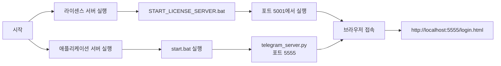
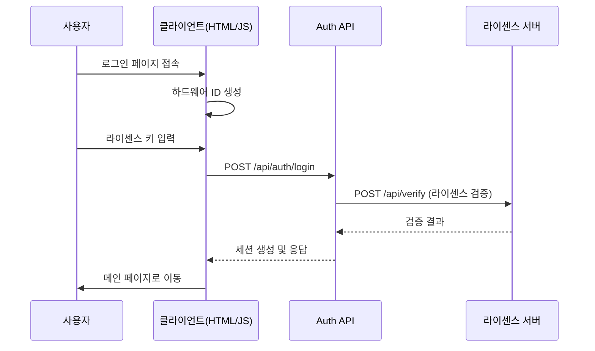
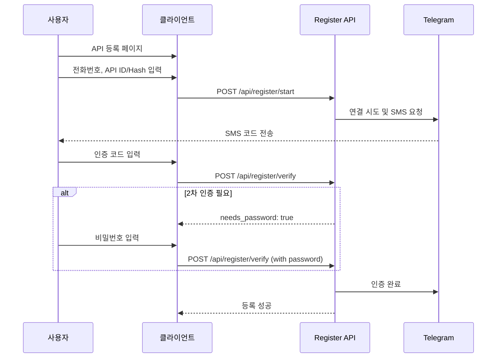
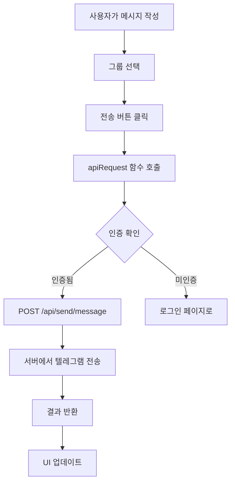

# 텔레그램 멀티 챗 매니저 - 워크트리 및 워크플로우 문서

## 📁 워크트리 구조

```
telegramwordl/
├── deploy/                      # 배포용 클라이언트 및 서버
│   ├── 프론트엔드 (웹 클라이언트)
│   │   ├── index.html          # 메인 대시보드
│   │   ├── login.html          # 로그인 페이지
│   │   ├── api_register.html   # API 등록 페이지
│   │   ├── app.js              # 메인 애플리케이션 로직
│   │   ├── config_client.js    # 클라이언트 설정
│   │   └── styles.css          # 스타일시트
│   │
│   ├── server/                 # 백엔드 서버
│   │   ├── telegram_server.py  # 메인 텔레그램 서버 (포트 5555)
│   │   ├── proxy_server.py     # 프록시 관리 서버 (포트 5002)
│   │   ├── api_register.py     # API 등록 블루프린트
│   │   ├── auth.py             # 인증 블루프린트
│   │   ├── utils.py            # 공통 유틸리티
│   │   ├── decorators.py       # 데코레이터 (인증, 에러 처리)
│   │   ├── app_factory.py      # Flask 앱 팩토리
│   │   └── account_config.json # 계정 설정
│   │
│   ├── start.bat               # 프록시 서버만 실행
│   ├── start_all.bat           # 모든 서버 실행
│   └── config.json             # 서버 설정
│
├── license_server/             # 라이센스 관리 서버
│   ├── server/
│   │   └── license_server.py   # 라이센스 서버 (포트 5001)
│   ├── templates/
│   │   ├── dashboard.html      # 관리자 대시보드
│   │   └── login.html          # 관리자 로그인
│   └── START_LICENSE_SERVER.bat # 라이센스 서버 실행
│
└── server/                     # 개발용 서버 (원본)
    └── sessions/               # 텔레그램 세션 파일
```

## 🔄 워크플로우

### 1. 시스템 시작 절차



### 2. 인증 플로우



### 3. API 등록 플로우



### 4. 메시지 전송 플로우



## 🔐 보안 체크포인트

### 1. 클라이언트 보안
- 모든 API 요청은 `apiRequest` 함수를 통해 처리
- 인증 실패 시 자동으로 로그인 페이지로 리다이렉트
- 하드웨어 ID 기반 라이센스 바인딩

### 2. 서버 보안
- 모든 API 엔드포인트는 `@login_required` 데코레이터로 보호
- Flask 세션 기반 인증 (24시간 타임아웃)
- 라이센스 서버를 통한 2차 검증

### 3. 통신 보안
- CORS 설정으로 크로스 도메인 보호
- 환경 변수를 통한 시크릿 키 관리

## 🚀 서버 역할 분담

### telegram_server.py (포트 5555)
- **주요 역할**: 통합 API 서버
- **담당 기능**:
  - API 등록 및 관리
  - 텔레그램 연결 및 인증
  - 세션 관리
  - 계정 정보 관리
  - 메시지 전송
  - 그룹 관리
  - 프록시 설정 관리

### license_server.py (포트 5001)
- **주요 역할**: 라이센스 관리
- **담당 기능**:
  - 라이센스 발급 및 검증
  - 사용 로그 추적
  - 관리자 대시보드
  - 하드웨어 ID 검증

## 📝 주요 API 엔드포인트

### 인증 관련
- `POST /api/auth/login` - 로그인
- `POST /api/auth/logout` - 로그아웃
- `GET /api/auth/status` - 인증 상태 확인

### API 등록 관련
- `POST /api/register/start` - 등록 시작
- `POST /api/register/verify` - 코드 인증
- `POST /api/register/resend-code` - 코드 재전송
- `GET /api/accounts/list` - 계정 목록

### 텔레그램 기능
- `POST /api/connect` - 텔레그램 연결
- `POST /api/verify` - 인증 코드 확인
- `POST /api/groups` - 그룹 목록 조회
- `POST /api/send/message` - 메시지 전송
- `POST /api/send/images` - 이미지 전송

## 🛠️ 개발 및 배포 가이드

### 개발 환경 설정
1. Python 3.8+ 설치
2. `pip install -r requirements.txt`
3. 환경 변수 설정:
   ```
   SECRET_KEY=your-secret-key
   LICENSE_SERVER_URL=http://localhost:5001
   ```

### 배포 절차
1. 라이센스 서버 실행: `license_server/START_LICENSE_SERVER.bat`
2. 애플리케이션 서버 실행: `deploy/start_all.bat`
3. 브라우저에서 `http://localhost:5555/login.html` 접속

### 문제 해결
- **포트 충돌**: 5555, 5001, 5002 포트가 사용 중인지 확인
- **세션 오류**: `server/sessions/` 폴더의 손상된 세션 파일 삭제
- **인증 실패**: 라이센스 서버가 실행 중인지 확인

## 📋 TODO 및 개선사항

1. **프론트엔드 개선**
   - [ ] 모든 fetch 호출을 apiRequest로 통일
   - [ ] 에러 처리 개선
   - [ ] 로딩 상태 표시

2. **백엔드 개선**
   - [ ] 서버 역할 명확히 분리
   - [ ] 로깅 시스템 강화
   - [ ] 성능 최적화

3. **보안 강화**
   - [ ] HTTPS 적용
   - [ ] Rate limiting 구현
   - [ ] 입력 검증 강화

4. **문서화**
   - [ ] API 문서 자동 생성
   - [ ] 코드 주석 추가
   - [ ] 사용자 가이드 작성